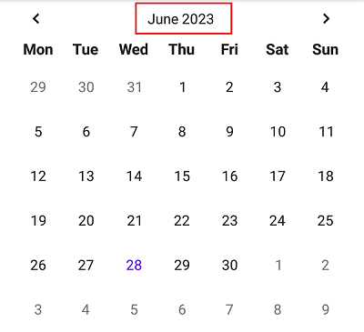

<h1 align="center">📅 RangeCalendarView</h1> <br/>
<p align="center">
  
  <br><br>
  A customizable, easy-to-use calendar with range selection
</p>

<div align="center">
  <a href="https://jitpack.io/#pelmenstar1/RangeCalendar">
    
  </a>

  
  
</div>

## Screenshots

 


## Getting started

This library is available on Jitpack.

Add it in your root build.gradle:

```gradle
allprojects {
  repositories {
    ...
    maven { url 'https://jitpack.io' }
  }
}
```

Add the dependency:

```gradle
implementation 'com.github.pelmenstar1:RangeCalendar:0.9.4'
```

Define `RangeCalendarView` in your XML layout:

```xml
<com.github.pelmenstar1.rangecalendar.RangeCalendarView
    android:id="@+id/picker"
    android:layout_width="match_parent"
    android:layout_height="wrap_content" />
```

Get notified when the date or range are selected:
<br/>

```kotlin
onSelectionListener = object : RangeCalendarView.OnSelectionListener {
    override fun onSelectionCleared() {
    }

    override fun onSelection(
        startYear: Int,
        startMonth: Int,
        startDay: Int,
        endYear: Int,
        endMonth: Int,
        endDay: Int
    ) {
    }
}
```

## Demo

[Try it yourself](https://github.com/pelmenstar1/RangeCalendar/releases/download/0.9.4/demo.apk)

## Selection view

It's a view that will be shown when user selects date or range. <br/>
**Visual example:**


To keep information on that view relevant, use `getOnSelectionListener()/setOnSelectionListener()` <br/>

- `getSelectionView()/setSelectionView()` to assign or get the view.
- `getSelectionViewTransitionDuration()/setSelectionViewTransitionDuration()` to assign or get duration (in
  milliseconds) of selection view show/hide animation
- `getSelectionViewTransitionInterpolator()/setSelectionViewTransitionInterpolator()` to assign or get time interpolator
  of selection show/hide animation
- `getSelectionViewLayoutParams()/getSelectionViewLayoutParams()` to assign or get layout params for the view
- `hasSelectionViewClearButton()/setHasSelectionViewClearButton()` to get or set whether on selection (if selection view
  is not null) 'next month' button will become 'clear selection' button.

## Minimum and maximum dates

- `getMinDate()/getMaxDate()` to get minimum and maximum dates respectively.
- `setMinDate()/setMaxDate()` to set minimum and maximum dates respectively.

## Listener

Use `getOnSelectionListener()/setOnSelectionListener()` to get or set the listener. In all methods, month and day of
month are 1-based.

- `onSelectionCleared()` fires when selection is cleared.
- `onSelection(startYear, startMonth, startDay, endYear, endMonth, endDay)` fires on selection. Start and end dates are inclusive.

## Animations

They are enabled by default (currently they cannot be disabled).

- `getCommonAnimationDuration()/setCommonAnimationDuration()` to get or set duration (in milliseconds) of common
  animations
- `getCommonAnimationInterpolator()/setCommonAnimationInterpolator()` to get or set time interpolator of common
  animations. By default, it's linear.
- `getHoverAnimationDuration()/setHoverAnimationDuration()` to get or set duration (in milliseconds)
  of hover animation
- `getHoverAnimationInterpolator()/setHoverAnimationInterpolator()` to get or set time interpolator of hover animation.
  By default, it's linear.
- `getCellAnimationType()/setCellAnimationType()` to get or set type of animation for cells. See `CellAnimationType`.

## Changing page of calendar

- `moveToPreviousMonth(withAnimation=true)` to slide to previous month (if it's possible) with animation or not (it's
  controlled by `withAnimation` flag)
- `moveToNextMonth(withAnimation=true)` to slide to next month (if it's possible) with animation or not (it's controlled
  by `withAnimation` flag)
- `setYearAndMonth(year, month, withAnimation=true)` to slide to given year & month with animation or not (it's
  controlled by `withAnimation` flag). If given page is out of enabled range, selected page will remain the same

## Custom selection manager

If you want to draw the selection in other way than the library does, you can implement `SelectionManager` on your own.
There are two main abstractions in selection management:

- 'selection state' - saves type of selection, its range (rangeStart and rangeEnd) and other data required to draw it on
  canvas.
- 'selection manager' - responsible for creating selection state and transitions between them. The manager is expected to be stateless, except caching instances of `renderer` and `transitionController`
- 'selection renderer' - responsible for rendering the selection state on `Canvas`. The implementation is not expected to be stateful, but it's acceptable to cache some information in order to make the rendering faster.
- 'selection transition controller' - responsible for mutating `SelectionState.Transition` internal data to make a transition.

There's a description of methods of `SelectionManager` and what they are expected to do:

- `createState(rangeStart, rangeEnd, measureManager)` - creates a **new** selection state. Note that, rangeEnd is **inclusive**. measureManager can be used to determine bounds of a cell and other info.
- `updateConfiguration(state, measureManager)` - updates internal measurements and computation based on measureManager results
  of both previousState and currentState. Change of measureManager result means that cells might be moved or resized.
- `createTransition(previousState, currentState, measureManager, options)` - creates a transitive state between previousState and currentState

Selection renderer is responsible for drawing simple selection state or transitive state, that is created to save information about transition between two selection states. When selection is to be drawn, the canvas' matrix is translated in such way that coordinates will be relative to the grid's leftmost point on top.

To use the custom implementation of `SelectionManager` is the calendar view,
use `RangeCalendarView.setSelectionManager()`
To use default implementation, pass `null` to setSelectionManager().

There's also a `CellMeasureManager` class which returns position and size of specified cell. It's passed as an argument
to some methods of `SelectionManager`. Although it's a public interface and it can be implemented on your own, you
cannot use your implementation in a calendar view. It's implemented inside the library.

## Gestures

The library allows to customize detecting gestures based on the `MotionEvent`s.
You can do this by specifying custom implementation of `RangeCalendarGestureDetectorFactory` that creates your implementation of `RangeCalendarGestureDetector`

```kotlin
class DetectorImpl : RangeCalendarGestureDetector() {
    override fun processEvent(event: MotionEvent): Boolean {
        // ... your code
    }
}

object DetectorImplFactory : RangeCalendarGestureDetectorFactory<DetectorImpl> {
    val detectorClass: Class<DetectorImpl>
        get() = DetectorImpl::class.java

    override fun create(): DetectorImpl {
        return DetectorImpl()
    }
}

rangeCalendar.gestureDetectorFactory = DetectorImplFactory
```

The gesture detection is based on detecting specific gesture __types__ that can be defined for your implementation:
```kotlin
class MyTypeConfiguration(val configValue: Float)

object DetectorImplGestureTypes {
  // Ordinal number is the thing that defines the gesture type. It's used for equality, hashing and comparing.
  val myType = RangeCalendarGestureType<MyTypeConfiguration>(ordinal = 0, displayName = "myType")
}
```

Each gesture type is associated with some type of options that may be needed in your implementation.

To create the configuration you can use builder method:
```kotlin
rangeCalendar.gestureConfiguration = RangeCalendarGestureConfiguration {
    enabledGestureTypes = setOf(DetectorImplGestureTypes.myType)

    gestureTypeOptions {
        put(DetectorImplGestureTypes.myType, MyTypeConfiguration(configValue = 1f))
    }
}
```

The library provides default gesture detector that detects these gestures:
- single tap to select a cell (`RangeCalendarDefaultGestureTypes.singleTapCell`)
- double tap to select a week (`RangeCalendarDefaultGestureTypes.doubleTapWeek`)
- long press to start selecting custom range and then move **one** pointer to specify the range (`RangeCalendarDefaultGestureTypes.longPressRange`)
- long press to start selecting custom range and then move **two** pointers to specify the range (`RangeCalendarDefaultGestureTypes.longPressTwoPointersRange`)
- horizontal pinch to select week (`RangeCalendarDefaultGestureTypes.horizontalPinchWeek`)
- diagonal pinch to select month (`RangeCalendarDefaultGestureTypes.diagonalPinchMonth`)

The configuration of gesture detector can be changed when the detector is default:
```kotlin
rangeCalendar.gestureConfiguration = RangeCalendarGestureConfiguration {
    enabledGestureTypes {
        doubleTapWeek()
        horizontalPinchWeek()
        // other types are disabled
    }
    
    gestureTypeOptions {
        // horizontalPinchWeek is associated with PinchConfiguration
        put(
            RangeCalendarDefaultGestureTypes.horizontalPinchWeek,
            PinchConfiguration(
                // 10 degrees
                angleDeviation = 10f * (180f / PI.toFloat()),
                minDistance = Distance.Relative(fraction = 0.5f, anchor = Distance.RelativeAnchor.WIDTH)
            )
        )
    }
}
```

## Time zone

- `getTimeZone()/setTimeZone()` to get or set calendar's time zone. By default, it's default system time
  zone (`TimeZone.getDefault()`). Calendar's time zone affects to "today" cell recognition. When new time zone is set, "
  today" cell is updated.

## Observing date and time-zone changes

This can be done manually by registering an `BroadcastReceiver` and updating time zone via `setTimeZone()` or notifying about today's date change via `notifyTodayChanged()`.
Or `RangeCalendarConfigObserver` can be used that, basically, does the same thing. The class is also lifecycle-aware.
Example:
```kotlin
val observer = RangeCalendarConfigObserver(rangeCalendar).apply {
    observeDateChanges = false // if we don't want rangeCalendar to be notified about these changes.
    observeTimeZoneChanges = true // by default, it's true. But can also be disabled.
}
observer.setLifecycle(lifecycle) // If we want to unregister the observer on destroy.
observer.register() // The observer should be registered manually.
```

## Weekday names

By default, the calendar will use localized weekdays in 'short' format. The format of localized weekdays can be changed via `weekdayType`. Currently there's only two options:

- `WeekdayType.SHORT`. If user locale is English, weekdays will look like: Mo, Tu, We, Th, Fr, Sa, Su
- `WeekdayType.NARROW`. If user locale is English, weekdays will look like: M, T, W, T, F, S, S.

If you want to change weekdays, it can be done via `weekdays`:

```kotlin
rangeCalendarView.weekdays = arrayOf("0", "1", "2", "3", "4", "5", "6")
```

If you want back to using localized weekdays, pass null to `weekdays`.

## The first day of the week

By default, information about the first day of the week is extracted from current locale's data. If the locale is changed, the first day of the week is re-computed.

If you want to use custom the first day of the week, use can change it via `firstDayOfWeek` or `intFirstDayOfWeek`:
```kotlin
rangeCalendarView.firstDayOfWeek = java.time.DayOfWeek.SATURDAY

// or

rangeCalendarView.intFirstDayOfWeek = java.util.Calendar.SATURDAY
```

Changing the first day of the week via these properties makes the first day of the week fixed, i.e it will be no longer updated on configuration updates. It also clears the selection if present. **NOTE: if values of the first day of the week on the time of saving view's state and restoring it are different, the saved selection is not restored.**

## Info textview

Info textview is in red rectangle:



Information about year and month of selected page is on that textview. The text can be changed by specifying custom `infoFormatter`:

```kotlin
rangeCalendar.infoFormatter = object : RangeCalendarView.InfoFormatter {
    override fun format(year: Int, month: Int): CharSequence {
        return "Year: $year Month: $month"
    }
}
```

If your implementation depends on current configuration's locale, use `RangeCalendarView.LocalizedInfoFormatter`.

If you want to use default localized implementation with custom datetime pattern, use `infoPattern`. **Note**: by default, specified format will be additionally processed by `android.text.format.DateFormat.getBestDateTimePattern` to find most suitable pattern for current locale. If it's undesirable, set `useBestPatternForInfoPattern` to `false`.

`useBestPatternForInfoPattern` property depends on `android.text.format.DateFormat.getBestDateTimePattern` that is available from API level 18. On older versions, this property changes nothing.

You can directly access info textview via `infoTextView` property.

## Other

- `getVibrateOnSelectingCustomRange()/setVibrateOnSelectingCustomRange()` to get or set whether the device should
  vibrate on start of selecting custom range.
- `getClickOnCellSelectionBehavior()/setClickOnCellSelectionBehavior()` to get or set behaviour when user (note, not
  from code) clicks on already selected cell. Use constants from `ClickOnCellSelectionBehavior`:
    - `NONE` - nothing happens
    - `CLEAR` - selection clears

## Style

| Attribute                                     | Description                                                                                                                                                                                                                                                                                          |
|-----------------------------------------------|------------------------------------------------------------------------------------------------------------------------------------------------------------------------------------------------------------------------------------------------------------------------------------------------------|
| rangeCalendar_selectionColor                  | Color of background of selection shape                                                                                                                                                                                                                                                               |
| rangeCalendar_dayNumberTextSize               | Text size of text in cells (day number)                                                                                                                                                                                                                                                              |
| rangeCalendar_inMonthDayNumberColor           | Color of day number which is in selected month range                                                                                                                                                                                                                                                 |
| rangeCalendar_outMonthDayNumberColor          | Color of day number which is out of selected month range                                                                                                                                                                                                                                             |
| rangeCalendar_disabledMonthDayNumberColor     | Color of day number which is out of enabled range                                                                                                                                                                                                                                                    |
| rangeCalendar_todayColor                      | Color of day number which represents today                                                                                                                                                                                                                                                           |
| rangeCalendar_weekdayColor                    | Color of text in weekday row (Mon, Tue, Wed...)                                                                                                                                                                                                                                                      |
| rangeCalendar_weekdayTextSize                 | Size of text in weekday row (Mon, Tue, Wed...)                                                                                                                                                                                                                                                       |
| rangeCalendar_hoverAlpha                      | Specifies alpha channel value of a black color that is drawn under the cell when the cell is in hovered state                                                                                                                                                                                        |
| rangeCalendar_cellSize                        | Size of cell                                                                                                                                                                                                                                                                                         |
| rangeCalendar_cellWidth                       | Width of cell. This value takes precedence over rangeCalendar_cellSize                                                                                                                                                                                                                               |
| rangeCalendar_cellHeight                      | Height of cell. This value takes precedence over rangeCalendar_cellSize                                                                                                                                                                                                                              |
| rangeCalendar_weekdayType                     | Type of weekday.                                                                                                                                                                                                                                                                                     |
| rangeCalendar_weekdays                        | Custom weekdays. The value should be a string array, whose length is 7.                                                                                                                                                                                                                              |
| rangeCalendar_clickOnCellSelectionBehavior    | Specifies behaviour when **user** clicks on already selected cell. It can be one of these values: <ul><li>none - nothing happens</li><li>clear - selection is cleared</li></ul>                                                                                                                      |
| rangeCalendar_cellRoundRadius                 | Round radius of the cell. By default it's positive infinity which means the shape is circle regardless the size of it.                                                                                                                                                                               |
| rangeCalendar_selectionFillGradientBoundsType | Specifies the way of determining bounds of selection. It only matters when selection fill is gradient-like. It can be one of these values: <ul><li>grid - gradient distribution is limited to grid of the calendar.</li><li>shape - gradient distribution is limited to selection shape.</li></ul>   |
| rangeCalendar_cellAnimationType               | Specifies type of animation for cell. It can be one of these values: <ul><li>alpha - the cell gradually appears using color alpha animation</li><li>bubble - the cell rises from the center as circle (or oval if width and height are different). Looks better when the cell is a circle.</li></ul> |
| rangeCalendar_showAdjacentMonths              | Specifies whether to show adjacent months on the calendar page. By default, it's true                                                                                                                                                                                                                |
| rangeCalendar_vibrateOnSelectingCustomRange   | Specifies  whether the device should vibrate on start of selecting custom range                                                                                                                                                                                                                      |
| rangeCalendar_isSelectionAnimatedByDefault    | Specifies whether selection animations is enabled by default. There's some cases when it can't really be controlled to animate selection or not, for example, selection by user. This property specifies whether to animate selection in such situations.                                            |
| rangeCalendar_isHoverAnimationEnabled         | Specifies whether hover animations is enabled.                                                                                                                                                                                                                                                       |
| rangeCalendar_infoPattern                     | Specifies date-time pattern for info text view (where current year and month is shown). The pattern should be suitable with `java.text.SimpleDateFormat`.                                                                                                                                            |
| rangeCalendar_useBestPatternForInfoPattern    | Specifies whether `android.text.format.DateFormat.getBestDateTimePattern` should be called on patterns set via `infoPattern` using the code or specified rangeCalendar_infoPattern in XML. By default, it's `true`.                                                                                  |
| rangeCalendar_infoTextSize                    | Text size of info text view                                                                                                                                                                                                                                                                          |
| rangeCalendar_firstDayOfWeek                  | Specifies custom first day of the week                                                                                                                                                                                                                                                               |

## Library status

The library is not production-ready and its public API shape can change from version to version. If you notice any kind
of bug or something unexpected, please file an issue.

## License

```
MIT License

Copyright (c) 2022 Khmaruk Oleg

Permission is hereby granted, free of charge, to any person obtaining a copy
of this software and associated documentation files (the "Software"), to deal
in the Software without restriction, including without limitation the rights
to use, copy, modify, merge, publish, distribute, sublicense, and/or sell
copies of the Software, and to permit persons to whom the Software is
furnished to do so, subject to the following conditions:

The above copyright notice and this permission notice shall be included in all
copies or substantial portions of the Software.

THE SOFTWARE IS PROVIDED "AS IS", WITHOUT WARRANTY OF ANY KIND, EXPRESS OR
IMPLIED, INCLUDING BUT NOT LIMITED TO THE WARRANTIES OF MERCHANTABILITY,
FITNESS FOR A PARTICULAR PURPOSE AND NONINFRINGEMENT. IN NO EVENT SHALL THE
AUTHORS OR COPYRIGHT HOLDERS BE LIABLE FOR ANY CLAIM, DAMAGES OR OTHER
LIABILITY, WHETHER IN AN ACTION OF CONTRACT, TORT OR OTHERWISE, ARISING FROM,
OUT OF OR IN CONNECTION WITH THE SOFTWARE OR THE USE OR OTHER DEALINGS IN THE
SOFTWARE.
```
