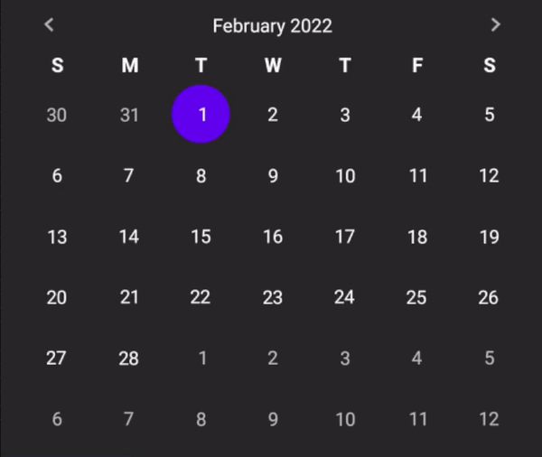
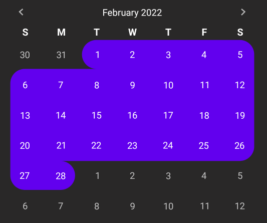
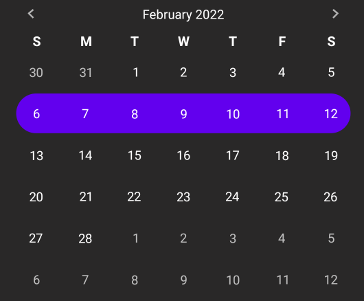
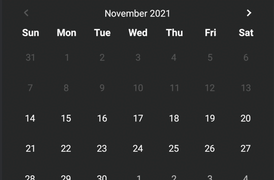

<h1 align="center">📅 RangeCalendarView</h1> <br/>
<p align="center">
  
  <br><br>
  A customizable, easy-to-use calendar with range selection
</p>

<div align="center">
  
  
  
</div>

## Screenshots

 


## Getting started

This library is available on Maven Central, add the following dependency:

```gradle
implementation 'io.github.pelmenstar1:rangeCalendar:0.9.2'
```

Define `RangeCalendarView` in your XML layout:

```xml

<io.github.pelmenstar1.RangeCalendarView android:id="@+id/picker"
    android:layout_width="match_parent" android:layout_height="wrap_content" />
```

Get notified when the date or range are selected:
<br/>
*(In example, the methods return true to mark that selection is valid. [More about it](#listener))*

```kotlin
calendar.onSelectionListener = object : RangeCalendarView.OnSelectionListener {
    override fun onSelectionCleared() {
    }

    override fun onDaySelected(year: Int, month: Int, day: Int): Boolean {
        return true
    }

    override fun onWeekSelected(
        weekIndex: Int,
        startYear: Int,
        startMonth: Int,
        startDay: Int,
        endYear: Int,
        endMonth: Int,
        endDay: Int
    ): Boolean {
        return true
    }

    override fun onMonthSelected(year: Int, month: Int): Boolean {
        return true
    }

    override fun onCustomRangeSelected(
        startYear: Int,
        startMonth: Int,
        startDay: Int,
        endYear: Int,
        endMonth: Int,
        endDay: Int
    ): Boolean {
        return true
    }
}

```

## Demo

[Try it yourself](https://github.com/pelmenstar1/RangeCalendar/releases/download/0.9.2/demo.apk)

## Selection view

It's a view that will be shown when user selects date or range. <br/>
**Visual example:**



To keep information on that view relevant,
use `getOnSelectionListener()/setOnSelectionListener()` <br/>

- `getSelectionView()/setSelectionView()` to assign or get the view.
- `getSelectionViewTransitionDuration()/setSelectionViewTransitionDuration()` to assign or get
  duration (in milliseconds) of selection view show/hide animation
- `getSelectionViewTransitionInterpolator()/setSelectionViewTransitionInterpolator()` to assign or
  get time interpolator of selection show/hide animation
- `getSelectionViewLayoutParams()/getSelectionViewLayoutParams()` to assign or get layout params for
  the view
- `hasSelectionViewClearButton()/setHasSelectionViewClearButton()` to get or set whether on
  selection (if selection view is not null) 'next month' button will become 'clear selection'
  button.

## Minimum and maximum dates

- `getMinDate()/getMaxDate()` to get minimum and maximum dates respectively.
- `setMinDate()/setMaxDate()` to set minimum and maximum dates respectively.

## Listener

Use `getOnSelectionListener()/setOnSelectionListener()` to get or set the listener. In all methods,
month and day of month are 1-based.

- `onSelectionCleared()` fires when selection is cleared.
- `onDaySelected(year, month, day)` fires when day is selected.
- onWeekSelected(weekIndex, startYear, startMonth, startDay, endYear, endMonth, endDay) fires when
  week is selected.
    - weekIndex - index of selected week, 0-based
- onMonthSelected(year, month) fires when month is selected.
- onCustomRangeSelected(startYear, startMonth, startDay, endYear, endMonth, endDay) fires when
  custom range is selected

The methods (except `onSelectionCleared()`) should return boolean that indicate whether the
selection is valid or not.

## Animations

They are enabled by default (currently they cannot be disabled).

- `getCommonAnimationDuration()/setCommonAnimationDuration()` to get or set duration (in
  milliseconds) of common animations
- `getCommonAnimationInterpolator()/setCommonAnimationInterpolator()` to get or set time
  interpolator of common animations. By default, it's linear.
- `getHoverAnimationDuration()/setHoverAnimationDuration()` to get or set duration (in milliseconds)
  of hover animation
- `getHoverAnimationInterpolator()/setHoverAnimationInterpolator()` to get or set time interpolator
  of hover animation. By default, it's linear.

## Changing page of calendar

- `moveToPreviousMonth(withAnimation=true)` to slide to previous month (if it's possible) with
  animation or not (it's controlled by `withAnimation` flag)
- `moveToNextMonth(withAnimation=true)` to slide to next month (if it's possible) with animation or
  not (it's controlled by `withAnimation` flag)
- `setYearAndMonth(year, month, withAnimation=true)` to slide to given year & month with animation
  or not (it's controlled by `withAnimation` flag). If given page is out of enabled range, selected
  page will remain the same

## Managing selection through the code

- `selectDay()` to select a day. If the day is out of enabled range, it won't be selected and
  listeners won't be fired.
- `selectWeek(year, month, weekIndex)` to select a week.
    - year should be in range of [1970; 32767]
    - month is 1-based
    - weekIndex is 0-based
- `selectMonth(year, month)` to select a month.
    - year should be in range of [1970; 32767]
    - month is 1-based
- `selectCustom(LocalDate startDate, LocalDate endDate)` to select custom range. The range should
  fit in single month, otherwise the exception will be thrown.
- `clearSelection()` to clear selection.

## Movement

- Double-touch to select a week
- Long-press to start selecting a custom range.
- Click on month information view (on top center) to select month

## Other

- `allowedSelectionTypes()` returns special object that manages allowed types of selection. Example:

    ```java
    calendar.allowedSelectionTypes().month(false).customRange(true)
    ```

  By code above, we disabled month and custom range selection. If selection type become disabled,
  it'll be automatically cleared.

    - `cell(boolean)` sets whether cell can be selected
    - `week(boolean)` sets whether week can be selected
    - `month(boolean)` sets whether month can be selected
    - `customRange(boolean)` sets whether custom range can be selected

  By default all types of selection are allowed.

- `getVibrateOnSelectingCustomRange()/setVibrateOnSelectingCustomRange()` to get or set whether the
  device should vibrate on start of selecting custom range.
- `getClickOnCellSelectionBehavior()/setClickOnCellSelectionBehavior()` to get or set behaviour when
  user (note, not from code) clicks on already selected cell. Use constants
  from `ClickOnCellSelectionBehavior`:
    - `NONE` - nothing happens
    - `CLEAR` - selection clears

## Style

<table>
    <tr>
        <th>Attribute</th>
        <th>Description</th>
    </tr>
    <tr>
        <td>rangeCalendar_selectionColor</td>
        <td>Color of background of selection shape</td>
    </tr>
    <tr>
        <td>rangeCalendar_dayNumberTextSize</td>
        <td>Text size of text in cells (day number)</td>
    </tr>
    <tr>
        <td>rangeCalendar_inMonthDayNumberColor</td>
        <td>Color of day number which is in selected month range</td>
    </tr>
    <tr>
        <td>rangeCalendar_outMonthDayNumberColor</td>
        <td>Color of day number which is out of selected month range</td>
    </tr>
    <tr>
        <td>rangeCalendar_disabledMonthDayNumberColor</td>
        <td>Color of day number which is out of enabled range</td>
    </tr>
    <tr>
        <td>rangeCalendar_todayColor</td>
        <td>Color of day number which represents today</td>
    </tr>
    <tr>
        <td>rangeCalendar_weekdayColor</td>
        <td>Color of weekday row (Mo, Tue, Wed...)</td>
    </tr>
    <tr>
        <td>rangeCalendar_weekdayTextSize</td>
        <td>Text size of weekday row (Mo, Tue, Wed...)</td>
    </tr>
    <tr>
        <td>rangeCalendar_hoverColor</td>
        <td>Color of background of hover shape</td>
    </tr>
    <tr>
        <td>rangeCalendar_hoverOnSelectionColor</td>
        <td>Color of background of hover shape that is in selection</td>
    </tr>
     <tr>
        <td>rangeCalendar_cellSize</td>
        <td>Size of cell</td>
    </tr>
    <tr>
        <td>rangeCalendar_cellSize</td>
        <td>Size of cell</td>
    </tr>
    <tr>
        <td>rangeCalendar_weekdayType</td>
        <td>
            Type of weekday. <br/> 
            Format of weekdays is very dependent on locale. In example, English locale is used.
            <ul>
                <li>shortName (WeekdayType.SHORT) - weekdays will look like Mob, Tue, Wed. </li>
                <li>narrowName (WeekdayType.NARROW) - weekdays will look like M, T, W,. </li>
            </ul>
        </td>
    </tr>
    <tr>
        <td>rangeCalendar_cellSize</td>
        <td>Round radius of the cell. By default it's positive infinity which means the shape is circle regardless the size of it.</td>
    </tr>
    <tr>
      <td>rangeCalendar_selectionFillGradientBoundsType</td>
      <td>
        Gets or sets the way of determining bounds of selection. 
        It only matters when selection fill is gradient-like.
        It can be one of these values:
        <ul>
          <li>grid - gradient distribution is limited to grid of the calendar.</li>
          <li>shape - gradient distribution is limited to selection shape.</li>
        </ul>
      </td>
    </tr>
</table>

## License

```
MIT License

Copyright (c) 2022 Khmaruk Oleg

Permission is hereby granted, free of charge, to any person obtaining a copy
of this software and associated documentation files (the "Software"), to deal
in the Software without restriction, including without limitation the rights
to use, copy, modify, merge, publish, distribute, sublicense, and/or sell
copies of the Software, and to permit persons to whom the Software is
furnished to do so, subject to the following conditions:

The above copyright notice and this permission notice shall be included in all
copies or substantial portions of the Software.

THE SOFTWARE IS PROVIDED "AS IS", WITHOUT WARRANTY OF ANY KIND, EXPRESS OR
IMPLIED, INCLUDING BUT NOT LIMITED TO THE WARRANTIES OF MERCHANTABILITY,
FITNESS FOR A PARTICULAR PURPOSE AND NONINFRINGEMENT. IN NO EVENT SHALL THE
AUTHORS OR COPYRIGHT HOLDERS BE LIABLE FOR ANY CLAIM, DAMAGES OR OTHER
LIABILITY, WHETHER IN AN ACTION OF CONTRACT, TORT OR OTHERWISE, ARISING FROM,
OUT OF OR IN CONNECTION WITH THE SOFTWARE OR THE USE OR OTHER DEALINGS IN THE
SOFTWARE.
```
